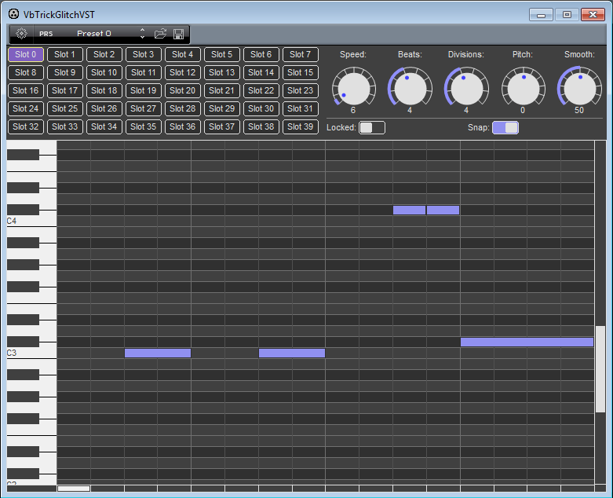

# VbTrickGlitch VST plugin.

## Description

Hello everyone!

This is a VST plugin written in VB6 which allows you to change the input sound according to the patterns. It just takes the small part of the input sound and propagates it according to the note frequency in the pattern. This sounds like stuttering / glitching. The plugin contains the 40 patterns each with its own settings.

Best Regards,

The trick.
